# SiteWipe

> **Private release candidate undergoing safety, privacy, accessibility, and release-readiness validation.**

`SiteWipe` is the owner-approved custom product identity for a local-first Chrome/Brave Manifest V3 extension that coordinates guarded, target-scoped cleanup across browser APIs. The exact name is already used by unrelated browser extensions, so this selection is not represented as unique or legally cleared. It is not a promise to erase every trace, it has not been published, and the current candidate version `1.11.6` is not an approved public version.

The interesting engineering problem is destructive scope control: a cleanup request must remain inside an authorized registrable site or exact local origin while Chrome exposes cookies, tabs, origin storage, history, downloads, scripting, and network rules through different APIs and lifecycle semantics.

## What is implemented

- A version-pinned, locally bundled Public Suffix List resolver with ICANN and PRIVATE rules, wildcards, exceptions, Unicode/IDN conversion, and fail-closed behavior.
- A deterministic, read-only scope-and-impact preflight followed by a mandatory per-run review and an explicit final activation before any destructive browser API is called. The same rule applies in Standard and Expert modes; old quick-approval messages, settings, and session records fail closed. Chrome/Brave may still show its own exact-target access prompt after SiteWipe's review.
- Standard and Expert policies. Standard mode disables associated-target expansion, on-disk file deletion, protected/PWA storage, broad discovery, and other higher-risk options.
- A recoverable Manifest V3 job state machine with monotonic cooperative cancellation, bounded discovery/concurrency, run-wide duration/query/record budgets, adapter timeouts, and explicit unknown outcomes.
- Versioned, correlated, sender-validated messages with payload bounds and response deadlines; stored approvals are recomputed and rejected if their target, settings, permissions, file IDs, or confirmations were altered.
- A durable target-access lease created before any browser prompt, preserving pre-existing grants and retaining recovery state until every temporary pattern is proved absent after completion, cancellation, expiry, failure, reset, or restart.
- A temporary `declarativeNetRequest` shield whose recovery intent is persisted before mutation and forgotten only after diagnostics prove the owned rule range empty.
- Central report redaction, short default retention, SHA-256 content checksums, and evidence states that do not turn failed or timed-out verification into zero.
- Keyboard and screen-reader semantics, live status messages, visible focus, forced-colors support, reduced-motion behavior, and destructive confirmation states.
- A deterministic runtime/source release builder with explicit closures, root-level `manifest.json`, checksum inventory, runtime SBOM, exact path/byte/timestamp parity, a canonical `dist/current/` index, transactional version updates covering the runtime and every stable release input, and evidence that cannot be rebound automatically to untested bytes.

Automated checks establish design and code-level evidence. Installed-browser behavior, accessibility, media, performance, repository settings, exact public-version approval, name-collision/legal review, and remote provenance remain publication gates until retained evidence exists.

## Safety boundary

SiteWipe is designed to reject:

- global or time-based `chrome.browsingData` removal;
- data types outside its origin-scoped allowlist;
- browser-internal, extension, file, credential-bearing, malformed, public-suffix-only, and unknown-suffix targets;
- protected Chrome/Brave account and Sync service targets;
- cleanup before a valid preflight approval token is consumed;
- associated targets outside the configured, preflight-bound scope and downloaded-file IDs outside the preflight snapshot;
- page scrub execution in the page's `MAIN` JavaScript world.

These categories are deliberately outside every cleanup path: passwords, passkeys/WebAuthn credentials, bookmarks, browser Sync/account state, autofill profiles, and payment methods. Chromium exposes form-data removal as a profile-wide operation that can affect saved payment data, so this project does not call it.

No browser extension can safely erase server, ISP, DNS-provider, VPN, firewall, operating-system, enterprise, synchronized, or unexposed browser-network-stack records. Browser APIs can also fail, time out, withhold private-window access, or leave unsupported residue. Reports preserve those limitations as limitations.

## Architecture

```mermaid
flowchart LR
  UI["Popup: visible normalized target"] --> Preflight["Read-only scope and impact preflight"]
  Preflight --> Review["Mandatory complete scope + impact review"]
  Review --> Activate["Explicit final activation"]
  Activate --> Lease["Durable temporary-access lease"]
  Lease --> Contract["Consumed single-use approval"]
  Contract --> Job["Persistent cleanup job"]
  Job --> Shield["Tracked DNR request shield"]
  Job --> Discovery["Bounded scope discovery"]
  Discovery --> Adapters["Cookies · tabs · origin storage · history · downloads"]
  Adapters --> Verify["Exposed-residue verification"]
  Verify --> Report["Redaction · checksum · short retention"]
  Shield --> Recovery["Clear + diagnose + forget"]
  Recovery --> Report
```



Browser-specific responsibilities live in separate modules under [`src/background`](./src/background), while pure scope, report, message, and state contracts live under [`src/shared`](./src/shared). The reviewed authorization/report boundary is isolated in `cleanup-authorization.js`; the remaining service-worker orchestration is still comparatively large and is tracked as a maintainability risk rather than described as small.

## Local review

Requirements: Node.js 24 or later and npm 11 or later.

```powershell
npm ci --ignore-scripts
npm run check
npm run test:coverage
npm run build:release-candidate
npm run verify:release-candidate
```

`npm run check:publication-gates` is expected to fail until every human, browser, remote-repository, media, and provenance decision has evidence. A passing unit suite is not publication approval.

For an unpacked, disposable-profile review:

1. Open `chrome://extensions` or `brave://extensions` in a disposable browser profile.
2. Enable Developer mode.
3. Choose **Load unpacked** and select this repository's `src` directory.
4. Use synthetic targets and data only.
5. Verify that both Standard and Expert modes always show the fresh detailed review, that every displayed acknowledgement is required, and that no target-access prompt or stale page can substitute for the final SiteWipe approval.

Do not test destructive options against a daily browser profile, real accounts, personal history, or irreplaceable downloads.

## Permissions at a glance

The default install has no required host pattern. Read-only preflight uses no new target host grant. After the complete review and from its final approval action, SiteWipe requests only missing preflight-bound `http`/`https` patterns and then immediately submits the single-use cleanup request. Chrome/Brave controls its own permission prompt, but that browser prompt is not cleanup consent. Before a prompt can appear, SiteWipe durably records exactly which patterns already existed and which would be temporary. Completion, cancellation, expiry, failure, restart maintenance, and extension-local reset reconcile only temporary patterns; the record remains until Chrome/Brave proves them absent, while pre-existing grants are preserved. `webNavigation` is optional and used only for embedded-frame discovery.

Named permissions cover origin-scoped browser data, cookies, tabs, history, download records, local extension state, isolated-world scripting, extension-owned DNR session rules, the side panel, and scheduled maintenance. The project intentionally removed `sessions` and `contentSettings` from the manifest.

See [`docs/permissions.md`](./docs/permissions.md), [`docs/permission-policy-matrix.md`](./docs/permission-policy-matrix.md), [`docs/decisions/0001-permission-reduction.md`](./docs/decisions/0001-permission-reduction.md), and [`docs/decisions/0009-mandatory-cleanup-review.md`](./docs/decisions/0009-mandatory-cleanup-review.md) for the threat model and alternatives.

## Evidence and limitations

- [`docs/claim-evidence.md`](./docs/claim-evidence.md) maps candidate public wording to code, automated checks, browser evidence, and approval status.
- [`docs/safety-case.md`](./docs/safety-case.md) states safety claims, assumptions, evidence, and residual risk.
- [`docs/capability-matrix.md`](./docs/capability-matrix.md) distinguishes implemented, partial, unsupported, and not-yet-browser-validated behavior.
- [`docs/release-readiness.md`](./docs/release-readiness.md) is the publication-gate ledger.
- [`docs/testing.md`](./docs/testing.md) separates fast local checks from installed Chrome/Brave evidence.
- [`PRIVACY.md`](./PRIVACY.md) describes local data, retention, redaction, exports, and deletion.

## Repository status and licensing

The owner has approved **SiteWipe** as the custom product identity, selected the [MIT License](./LICENSE) for the first-party project source, confirmed the recorded provenance statement, and authorized the first truthful commit and upload to `NouraldinFarge/SiteWipe` as a private staging repository. The package remains `private: true` to prevent accidental npm publication. Public GitHub visibility, a tag or release, store submission, and professional-profile use remain separately gated. Known exact-name marketplace collisions remain disclosed and legal clearance is not claimed.

Third-party material is not relicensed as first-party work and remains governed by its own terms in [`THIRD_PARTY_NOTICES.md`](./THIRD_PARTY_NOTICES.md). The current candidate icon has an editable, project-controlled SVG and reproducible PNG provenance under [`assets/brand`](./assets/brand); authentic installed-product media and final store-brand approval remain open.

## AI-assisted development disclosure

This project was developed with substantial AI-agent assistance. AI-produced and human-produced changes are treated as untrusted until reviewed through static checks, adversarial tests, installed-browser tests, and explicit owner approval. The repository does not claim complete hand-written authorship.

## Documentation map

- [Architecture](./docs/architecture.md)
- [Threat model](./docs/threat-model.md)
- [Safety case](./docs/safety-case.md)
- [Permissions](./docs/permissions.md)
- [Privacy data flow](./docs/privacy-data-flow.md)
- [Testing](./docs/testing.md)
- [Performance](./docs/performance.md)
- [Releasing](./docs/releasing.md)
- [Product-name research](./docs/product-name-research.md)
- [Security policy](./SECURITY.md)
- [Contributing](./CONTRIBUTING.md)
