# Architecture

> **Public-source prerelease candidate undergoing safety, privacy, accessibility, and binary-release validation.**

Last reviewed: 2026-08-21. `SiteWipe` is the owner-approved custom product identity. `1.11.46` remains a public-source prerelease version. Exact installed 1.11.38, 1.11.39, and 1.11.42 are retained as distinct historical failures, not approved public binary releases. The current working candidate contains the action-popup sentinel correction; its complete validation/evidence transaction, replacement version, and exact-artifact installed validation remain pending.

## Design objective

The extension coordinates several Chrome APIs that expose different notions of “site.” Its central design problem is to preserve one freshly authorized target boundary across normalization, discovery, mutation, verification, reporting, and interruption recovery. The architecture therefore puts pure, fail-closed scope logic in front of every browser adapter and keeps destructive work behind a single-use preflight approval record.

The worker-owned optional-host-permission handoff safely exposed three distinct installed blockers. Exact 1.11.38 lost its popup continuation after Chrome opened the native permission prompt. The source remediation for that defect then made exact 1.11.39 require `runtime.MessageSender.documentId`, but Chrome action-popup messages may omit that optional field, so preparation failed closed before review. Exact 1.11.42 replaced that optional identity with `runtime.getContexts()` and passed extensive source validation, but its worker and mock incorrectly modeled the action popup's `windowId` as the positive source browser-window ID; Chrome reports the popup itself with `windowId: -1`. SW-034 through SW-036 and the active evidence records keep the complete validation/evidence transaction and exact-artifact installed validation of the next corrective candidate open. Historical source totals do not certify browser compatibility or turn any failed installed run into a pass.

## System context

```mermaid
flowchart LR
  Person["User in disposable or normal browser"] --> Popup["Popup: enter or select target"]
  Popup --> Normalize["Canonical parser + bundled PSL"]
  Normalize --> Contract["Validated read-only preflight request"]
  Contract --> Identity["Worker resolves one POPUP contextId + mints bound capability"]
  Identity --> Policy{"Saved direct authorization?"}
  Policy -->|no| Review["Complete scope + impact review"]
  Review --> Activation["Explicit final user activation"]
  Policy -->|yes| Activation["One SiteWipe Clean now activation"]
  Activation --> Access{"Missing exact normal-window access?"}
  Access -->|no| Message["Versioned detailed-review/settings-direct contract"]
  Access -->|yes| Permission["Invoke permissions.request first; retain promise"]
  Permission --> Arm["Immediately dispatch worker arm without awaiting"]
  Arm --> Await["First await is the native permission promise"]
  Await --> Wake["Native settlement or permissions.onAdded wake"]
  Wake --> Proof["Worker proves armed nonce + complete exact grant"]
  Proof --> Message
  Message --> Approval["Consume session-scoped single-use approval"]
  Approval --> Authorization["Independent reviewed-cleanup authorization boundary"]
  Authorization --> Worker["MV3 cleanup orchestration"]
  Worker --> Chrome["Chrome/Brave extension APIs"]
  Worker --> Page["Isolated-world page scrub"]
  Worker --> State["Local job, shield, settings, report state"]
  Chrome --> Verify["Explicit verification evidence"]
  Page --> Verify
  Verify --> Report["Central redaction and SHA-256 checksum"]
  Report --> Popup
  Report --> Panel["Side-panel review and local export"]
```



The shipped runtime contains no project server, analytics client, telemetry transport, or runtime Public Suffix List download. Browser and website network activity remains outside this component boundary.

## Trust boundaries and authority

| From → to                        | Trust level / hazard                                                                                                                    | Enforcement point                                                                                                                                                                                                                                                                                                                                                                                                                                                                                                             |
| -------------------------------- | --------------------------------------------------------------------------------------------------------------------------------------- | ----------------------------------------------------------------------------------------------------------------------------------------------------------------------------------------------------------------------------------------------------------------------------------------------------------------------------------------------------------------------------------------------------------------------------------------------------------------------------------------------------------------------------- |
| User input → scope policy        | Untrusted URL text, credentials, Unicode, ports, local/IP values, associated targets                                                    | URL parsing, safe-scheme checks, bundled PSL/PRIVATE resolution, protected-service denial, exact-origin rules, independent associated-target normalization                                                                                                                                                                                                                                                                                                                                                                    |
| Browser page state → preflight   | Untrusted and race-prone URLs, frames, cookies, records, storage metadata                                                               | Read-only bounded adapters, exact/dot-boundary matching, caps/timeouts, explicit incomplete/unknown impact evidence                                                                                                                                                                                                                                                                                                                                                                                                           |
| Preflight → review/direct policy | Privileged proposal, not authorization                                                                                                  | Complete immutable target/settings/context/impact/access/file-ID snapshot; visible presentation and acknowledgements in default detailed mode, or explicit saved setting plus truthful no-acknowledgement `settings_direct` mode                                                                                                                                                                                                                                                                                              |
| UI → message boundary            | User activation can be stale, forged, duplicated, lost with the popup, or falsely claim acknowledgements                                | Explicit Settings confirmation for the default-off direct opt-in; detailed controls/typed phrase when shown; exact popup URL and absent `sender.tab`; worker-resolved unique `POPUP` `contextId` using Chrome's action-popup sentinel metadata; independent source-window/private inspection; digest-bound popup capability; `permissions.request()` invocation followed immediately by non-awaited arm dispatch before the first await; prepared-mode equality; no caller skip flag                                          |
| Message → session approval       | Stored approval or handoff can be stale, corrupted, replayed, duplicated, rebound to another popup, or from an older schema             | Consume-before-mutate, five-minute expiry, random single-use review token plus worker-generated handoff nonce and popup capability, digest-only capability storage, constant-time comparison, same-context retry rotation before handoff, old-context absence proof for pregranted rebind only, missing-access cross-context tombstoning/no transfer, complete authority reconstruction, strict `arming`/`armed`/`admitting` transitions, and exact schema/version/context/current-settings/target/impact/permission matching |
| Approval → cleanup orchestration | Refactors could accidentally bypass the prepared authority                                                                              | `cleanup-authorization.js` independently accepts only `detailed_review` or setting-backed `settings_direct`, rejects direct mode when the effective setting is not true, and initializes truthful mode evidence before report/job orchestration                                                                                                                                                                                                                                                                               |
| Orchestrator → browser APIs      | APIs are privileged, partial, asynchronous, and not transactionally atomic                                                              | Per-adapter target/private-scope guards, explicit origin/type plans, live tab/download identity revalidation, budgets, phase ordering, unknown outcomes, and safety-only finalizers                                                                                                                                                                                                                                                                                                                                           |
| Host permission → cleanup scope  | Exact or broader permission grants capability but not intent; popup lifetime and permission events are not an authorization transaction | Canonical required-pattern model, privacy-minimized `permissions.getAll()` inventory, preflight-bound `prompt_pending` lease and worker nonce before the actionable button, `permissions.onAdded` as wake only, full exact temporary-grant proof, and per-adapter matchers; partial/broad/manual-without-handoff grants never admit cleanup                                                                                                                                                                                   |
| Runtime → local/session storage  | Local records may expose browsing context or survive worker suspension                                                                  | Strict state schemas, serialized writes, central scrubbing, redaction, 30-minute latest expiry, history off, private-context persistence refusal                                                                                                                                                                                                                                                                                                                                                                              |
| Runtime → DNR session rules      | Interrupted rule updates can leave browser traffic blocked                                                                              | Reserved rule range, persist-before-mutate, full-range diagnosis, restart recovery, and absence proof before forgetting state                                                                                                                                                                                                                                                                                                                                                                                                 |
| Report → export/support boundary | Structured and free-form values can leak URLs, credentials, paths, identities                                                           | Recursive redaction, adversarial serialization canaries, post-transform SHA-256 checksum, explicit unredacted-export warning                                                                                                                                                                                                                                                                                                                                                                                                  |
| Source → release artifact        | Private files, symlinks, stale output, remote code, or unreviewed bytes can enter ZIP                                                   | Explicit closures, symlink rejection, static capability/secret scans, deterministic rebuilds, exact parity, checksums, SBOM, and human/remote gates                                                                                                                                                                                                                                                                                                                                                                           |

The browser is trusted to enforce its extension platform and permission boundaries, but values returned by its APIs are treated as incomplete and mutable. Local extension storage is trusted only as persistence: every authority-bearing record is revalidated before use. Web pages are always untrusted, and injected cleanup runs only in the isolated extension world.

## Runtime layers

| Layer                   | Main modules                                                                                                                                             | Responsibility                                                                                                                                                                                                                                                                       |
| ----------------------- | -------------------------------------------------------------------------------------------------------------------------------------------------------- | ------------------------------------------------------------------------------------------------------------------------------------------------------------------------------------------------------------------------------------------------------------------------------------ |
| User interface          | `popup/`, `options/`, `sidepanel/`, `shared/settings-backup.js`                                                                                          | Visible normalization, default detailed review, explicitly confirmed direct-cleanup setting in both modes, one-action popup dispatch, progress, bounded/schema-checked backup import, reports, and local exports                                                                     |
| Message boundary        | `shared/message-contracts.js`, `shared/messaging.js`                                                                                                     | Versioned/correlated envelopes, sender checks, message allowlist, field/type/size validation, response deadlines, and structured errors                                                                                                                                              |
| Scope policy            | `background/domain.js`, `shared/public-suffix.js`, `shared/target-scope.js`, `shared/safety.js`                                                          | PSL-backed registrable boundaries, exact local origins, protected targets, and cross-adapter matching                                                                                                                                                                                |
| Review/direct policy    | `background/cleanup-preflight.js`, `background/permission-leases.js`, `shared/cleanup-review.js`, `shared/cleanup-mode.js`, `shared/host-permissions.js` | Read-only impact/access inspection, exact/broad grant inventory, detailed or setting-derived direct mode, complete authority snapshot, single-use session approval, worker-owned prompt handoff/tombstone, durable temporary exact-access ownership, and Standard/Expert enforcement |
| Authorization boundary  | `background/cleanup-authorization.js`, `shared/message-contracts.js`                                                                                     | Independently require one allowed preflight mode, require the direct setting when applicable, validate target/time evidence, and initialize truthful authorization/report evidence before orchestration                                                                              |
| Orchestration           | `background/service-worker.js`, `background/cleanup.js`                                                                                                  | Exactly-once handoff admission, nonce-bound persistent jobs, phase ordering, cancellation checks, permission lifecycle, cleanup finalization, and maintenance                                                                                                                        |
| Browser adapters        | `cookies.js`, `origin-storage.js`, `history.js`, `downloads.js`, `tab-state.js`, `scope-discovery.js`, `record-discovery.js`                             | Bounded reads and target-constrained mutations for individual Chrome APIs                                                                                                                                                                                                            |
| Live page               | `page-scrub.js`, `progress-overlay.js`                                                                                                                   | Self-contained scripts injected only into matching `http`/`https` frames in the isolated extension world                                                                                                                                                                             |
| Request shield          | `dnr-shield.js`, `shield-recovery.js`                                                                                                                    | SiteWipe-owned DNR session-rule range, persist-before-mutate lifecycle, diagnostics, and recovery                                                                                                                                                                                    |
| Evidence                | `verification.js`, `shared/verification-evidence.js`, `background/report.js`                                                                             | Per-surface verification states, partial outcomes, limitations, timing, and confidence explanation                                                                                                                                                                                   |
| Privacy and persistence | `shared/storage.js`, `shared/state-schema.js`, `shared/report-redaction.js`, `shared/report-integrity.js`                                                | Stored-state validation, redaction, retention, migration, and SHA-256 content checksums                                                                                                                                                                                              |

## Cleanup sequence

```mermaid
sequenceDiagram
  participant U as User
  participant P as Popup
  participant W as Service worker
  participant S as Session storage
  participant L as Local durable state
  participant B as Browser APIs

  U->>P: Enter/select target (direct) or activate Review cleanup (default)
  P->>W: prepareCleanupReview
  W->>B: Resolve exactly one POPUP contextId by exact URL/type and action-popup sentinel metadata
  W->>B: Independently inspect the positive source window ID and private state
  W->>W: Mint popup capability; retain only its digest with the review
  W->>B: Read-only impact + granted-host inventory queries only
  W->>L: Persist temporary-access lease before any possible grant
  W->>S: Store short-lived mode/context/capability-digest-bound record
  W-->>P: Normalized review plus raw capability held only in popup memory
  alt detailed_review (default)
    P-->>U: Display complete review and applicable acknowledgements
    U->>P: Explicitly approve the displayed review
  else settings_direct (opt-in)
    P-->>U: Keep preflight hidden; enable Clean now only after lease persistence
    U->>P: One SiteWipe Clean now activation
  end
  alt all exact access was present at preflight
    P->>W: runDeepClean with prepared mode, token, and context
  else missing exact normal-window access
    P->>B: Invoke permissions.request first and retain its promise
    P-->>W: Immediately dispatch armCleanupApproval with capability; do not await
    Note over P,B: The first await is the gesture-gated permission promise
    W->>W: Validate exact popup/no-tab sender, capability digest, approval, context, lease, expiry, and worker nonce
    W->>S: Move non-runnable arming to armed
    B-->>P: Grant or withhold access if the popup survives
    B-->>W: permissions.onAdded wake on grant; no authority by itself
    P-->>W: Optional resumeArmedCleanup wake after prompt settlement
    W->>W: Converge wakes; prove armed nonce and complete exact temporary grant
    W->>S: Move armed to no-retry admitting exactly once
  end
  W->>S: Consume token before recovery or cleanup mutation
  W->>W: Re-read settings/private access and reconstruct the complete authority snapshot
  W->>W: Initialize truthful detailed/direct authorization evidence
  W->>L: Mark access lease active
  alt admitting armed handoff
    W->>L: Persist job binding nonce, popup context/digest, and handoff_admitting phase
    W->>S: Remove consumed handoff
    W->>L: Mark the durable job admitted
  else pregranted access
    W->>L: Persist running job
  end
  W->>L: Persist shield intent when applicable
  W->>B: Install target request shield
  W->>B: Discover, scrub, close, and remove by phase
  W->>B: Re-query exposed verification surfaces
  W->>B: Clear owned shield range and diagnose
  W->>B: Release only access absent before preflight
  W->>L: Forget lease only after permission absence is proved
  W->>L: Persist redacted, expiring report when eligible
  W-->>P: Privacy-policy-aligned report response
```

Only one unexpired preflight approval may exist at a time. Preparation accepts only the exact popup URL with no `sender.tab`, independently rechecks the positive source browser-window ID/private state through `chrome.windows.get`, and uses a bounded `runtime.getContexts()` query to require exactly one exact-URL `POPUP` context. Current Chrome action popups report `tabId: -1` and `windowId: -1`; that runtime metadata is not the positive source browser-window identity. With SiteWipe's `spanning` incognito behavior, the popup extension context remains in the shared profile while the independently inspected source window may be private. The worker binds the required opaque `ExtensionContext.contextId` and a SHA-256 digest of a high-entropy capability to the review; `MessageSender.documentId` remains optional and is not used as a required identity. The raw capability is returned only to the current popup's memory and is never written into the persisted review snapshot.

A response retry from the same bound context may rotate the capability only while no handoff or pending arm owns settlement. A pregranted review may rebind to a replacement popup only after `getContexts({ contextIds: [oldContextId] })` proves the old context gone. A missing-access review is never transferred to another popup merely because the old context disappeared: the native prompt may already have been invoked, so the worker converts the record into a permanently non-runnable reconciliation obligation until a real browser-session boundary permits a fresh review. Zero, multiple, mismatched, unknown, or still-live-old contexts fail closed before authority is returned.

In direct mode, the complete hidden preflight, worker-generated handoff nonce, popup-context binding, and durable `prompt_pending` lease finish before **Clean now** is enabled. The approval record is consumed before the first mutation-capable recovery or cleanup phase. On consumption, its schema, prepared approval mode, normalized target, current effective settings, associated scope, and current browser private-access state are recomputed and compared; the preflight-captured exact/broader/all-site inventory is canonicalized and its derived fields are reconstructed to detect tampering; current exact required target access is rechecked; and the complete normalized impact/review snapshot, file IDs, permission ownership, and mode-appropriate acknowledgement claims must still match. Malformed, tampered, or stale session state is discarded. The message contract, review validator, preflight consumer, and authorization module accept only `detailed_review` or `settings_direct`; direct is derived from strict current `skipCleanupReview === true`, and its payload must truthfully contain false per-run acknowledgements plus an empty file phrase. No caller skip flag or raw direct route exists.

When exact access is missing for a normal-window run, the final click invokes `permissions.request()` first and retains its promise, immediately dispatches `armCleanupApproval` without awaiting it in the same synchronous activation, and makes the permission promise the first `await`. This preserves the browser's user-activation requirement while submitting the prepared approval before asynchronous prompt settlement can strand it. The arm must carry the raw preparation capability. The worker accepts it only from the exact popup URL with no `sender.tab` and only after a constant-time digest match against the context-bound review. It deliberately performs no live `getContexts()` lookup at arm time because the native prompt may already be tearing down that popup. Missing, wrong, replayed, or superseded capabilities fail closed; the capability is also required for explicit denial/abandonment settlement and any cancellation that asserts `promptNotStarted: true`, so a different popup cannot settle or cancel the prepared prompt by knowing only its token or context ID.

The valid arm binds the existing token, nonce, approval, source window/private state, settings, target, impact, file IDs, and `prompt_pending` lease. `arming` owns prompt settlement but cannot run; `armed` is the only resumable state; and the first valid continuation changes it to `admitting`, a permanent no-retry boundary. Before the session handoff is removed, a durable job binds the handoff nonce and admission phase plus only the popup `contextId` and capability SHA-256 digest needed to authenticate terminal `resumeArmedCleanup` replay by the surviving initiating popup across a worker restart. The raw capability remains popup-memory-only and never enters review, job, report, or debug storage. The popup's post-prompt `resumeArmedCleanup` message and `permissions.onAdded` can both wake convergence, but neither grants authority: admission still requires the unexpired `armed` record plus a fresh inventory proving every preflight-classified temporary exact pattern. Wake-only event cohorts never mix with explicit-nonce cohorts. A partial grant, a broader grant, or manually added access without this handoff cannot satisfy that pending missing-access approval; independently granted access can be treated as pre-existing only by a later fresh preflight. Duplicate or out-of-order wakes cannot create a second job.

Exact lease-owned access is not trusted from a single observation. It is re-proved while the armed approval is consumed, after durable job admission before any start badge or debug-log presentation, and immediately before the first browser-data adapter. A permission removal or inventory mismatch at any checkpoint fails closed without scheduling browser-data mutation.

A settings, target, source-context, reset, or expiry invalidation before admission creates a non-runnable prompt tombstone rather than forgetting a prompt that may still settle. The tombstone survives worker wakes until exact settlement permits conservative reconciliation of only the preflight-classified temporary patterns, or until a real browser-session boundary proves that the old native prompt cannot remain. Broader and pre-existing user-controlled grants never enter automatic removal. The popup disables an expired review on a live timer and repeats the expiry check synchronously before permission-request invocation and arm dispatch, while the worker remains the final fail-closed authority. After the native prompt returns, the bound popup first performs authenticated capability/nonce-bound `resumeArmedCleanup` reconciliation. If the worker admitted the handoff before its deadline, the popup renders the matching running job or terminal report and never claims that no cleanup started. Only a matching canceled outcome with `cleanupStarted: false`, `temporaryAccessReleased: true`, and strict proof that temporary access is absent and the recovery record was removed may show no-cleanup, access-released, and fresh-review guidance. An unknown outcome retains the popup binding, locks new cleanup, and directs the user to the current job/report or Options without claiming either admission or release. For a rejected or otherwise non-runnable handoff, terminal settlement remains worker-owned: only the worker may remove the preflight-classified temporary exact patterns, and the popup never removes permissions directly. Private-source cleanup never uses the missing-access handoff: it still requires browser-controlled **Allow in incognito** and pre-existing exact target access. This protocol does not change the downloaded-file setting, preflight file-ID binding, or Standard-mode preservation behavior. Runtime cancellation is cooperative between major phases; it cannot reverse a phase already completed, and cancellation state is never inherited by an unrelated replacement job.

## Scope representation

A normalized target is one of:

- `registrable_domain`: a full PSL-derived registrable site plus its subdomains;
- `exact_origin`: an explicitly allowed local/IP `scheme://host:port` boundary; cookies remain host-scoped because cookie semantics do not include ports.

Every associated target is independently normalized and protected-target checked, displayed/acknowledged in detailed mode, hidden-preflight-bound in direct mode, and always bound to the approval. There is no string-suffix-only authorization: host checks require an exact match or a dot boundary, and exact origins retain scheme and effective port. The popup accepts only an explicit source-window ID plus Boolean private state; the worker independently inspects that exact window before preflight or permission-lease work and repeats the check after token consumption, so an absent, partial, closed, or mismatched source fails closed. The preflight private-window flag is immutable cleanup authority: normal-only runs exclude private tabs during discovery, page injection, overlays, tab-state changes, closure, and verification even if the browser's global incognito setting changes later. Origin-removal plans are checked again against the authorized target immediately before `browsingData.remove`; tabs are re-read and re-matched immediately before mutation; and downloaded files are removed only after an exact-ID browser re-query proves the preflight target, completion/existence state, approval, and filename/URL/referrer identity unchanged.

The bundled PSL snapshot includes ICANN and PRIVATE sections, wildcard rules, exception rules, and IDN/punycode normalization. Unknown suffixes and public-suffix-only inputs fail closed for destructive use.

## Persistent MV3 state

MV3 service workers can stop between events, so the runtime persists only the state needed to make interruption visible and recover extension-owned rules:

- active job status, phase, timestamps, progress, and cancellation request;
- active request-shield lifecycle and owned rule identifiers;
- a durable target-access lease containing only canonical preflight-requested patterns, their pre-existing/temporary classification, `prompt_pending`/active/release status, the worker-generated handoff nonce, the five-minute approval expiry, and a separate conservative 30-minute prompt-settlement recovery deadline;
- sanitized settings and maintenance snapshot;
- a redacted latest report for 30 minutes by default, with history off, only when private-window access is disabled;
- the approval token and complete validated approval snapshot in `chrome.storage.session`, never in durable local storage;
- at most one session-scoped permission handoff in non-runnable `arming`, resumable `armed`, no-retry `admitting`, or non-runnable `prompt_tombstone` state, bound to the preflight token, lease, nonce, exact popup/source context, and final approval.

Stored job and shield strings pass through the central sensitive-value scrubber. Reports are not persisted whenever private-window access is enabled or private scope is otherwise observed. Permission recovery preserves every pattern classified as pre-existing and removes the durable lease only after strict permission queries prove every temporary pattern absent; malformed lease state calls no permission mutation and requires manual/retried recovery. Recovery never resumes an interrupted cleanup automatically. The narrower pre-job exception is an explicitly armed, unexpired optional-permission handoff: a native permission event or popup settlement may wake the worker to admit that already-authorized cleanup exactly once, including after popup destruction. Otherwise recovery marks interrupted work and repairs only SiteWipe-owned DNR or temporary-access state.

## Failure semantics

Browser calls are bounded by caps, batching, concurrency limits, adapter timeouts, and run-wide duration/query/record budgets. The current read-only preflight ceiling is 45 seconds, 750 queries, and 100,000 observed records; cleanup is 210 seconds, 1,000 queries, and 250,000 observed records. A timeout is treated as an unknown outcome because the underlying browser call may still finish. In particular, a timed-out tab removal is not counted as a definite failure or success, and a point-in-time empty DNR range is only provisional while any original rule-install or rule-clear promise remains pending. A newer shield cannot reuse the owned range until every tracked older mutation settles. Each adapter emits the same attempted/succeeded/failed/timed-out/unknown/skipped/capped outcome shape, and the report distinguishes:

- successful mutation;
- safe skip;
- unsupported browser capability;
- partial result;
- ordinary failure;
- timeout/unknown completion;
- verified zero versus verified residue.

Cleanup finalization runs in `finally` paths. Browser cleanup completion is kept separate from report/job persistence, so a bookkeeping failure cannot relabel completed browser work as failed. Report persistence uses the privacy settings bound for that run rather than a newly changed settings value. Settings, reset, request-shield mutation, and manual-maintenance routes reject a live cleanup; Options mirrors those guards by disabling and explaining affected controls. A settings change or reset during a possibly open native permission prompt tombstones the handoff and cannot admit cleanup. Prompt denial, partial grant, expiry, stale authority, permission removal, API failure, and worker restart all remain non-mutating unless the worker can re-establish the complete `armed` proof; once admission reaches `admitting`, it is never retried as a second cleanup. Switching to Standard, entering Expert, disabling embedded discovery, or resetting settings persists embedded-frame discovery off and removes `webNavigation`, preventing a stale full-form save/import from silently reviving the optional feature. Settings backup import is size-bounded, schema/app/version checked, allowlisted, value-validated, previewed, and explicitly confirmed, including direct-cleanup risk. Local read-modify-write paths for settings, jobs, shields, reports, debug records, maintenance, and handoff admission are serialized; cancellation is monotonic within one job, is not inherited across job IDs, and a missing/replaced live job makes the old run stop scheduling work. A shield record is removed only after diagnostics prove the complete owned rule range empty and every timed-out rule mutation has settled; otherwise the recovery obligation remains. Normal-only preflight-bound runs install no DNR shield because shared session rules cannot be constrained to normal windows. If the DNR or permission API is missing, fails, or times out, recovery intent remains stored or is reconstructed from observable state.

## Build boundary

`src/` is directly loadable and has no runtime npm dependency or compilation step. `scripts/release-files.mjs` is the only runtime package allowlist. The deterministic release builder maps those files to ZIP root, normalizes order and metadata, reopens both runtime and complete source archives, compares every path/byte/timestamp with the declared source closure, rejects symbolic links, and creates checksums, an SBOM, release notes, and an unsigned provenance input. A staged build is promoted to `dist/current/` only as a complete directory and indexed by `current-release.json`, preventing stale root artifacts from being selected accidentally. Version changes use a recoverable multi-file journal and fingerprint both the allowlisted runtime and every stable release input. Mutable post-build evidence and owner-approval JSON are excluded from the stable-input fingerprint so recording exact-artifact results does not invalidate the artifact being reviewed. Build automation updates only automated evidence and never rebinds human browser/accessibility/performance results to untested bytes. GitHub attestation remains a remote release gate.

## Decisions and evidence

Browser evidence is deliberately split. ChatGPT in-app Browser checks of an HTTP-served synthetic UI may establish web-layout, semantics, and interaction evidence only. Installed-extension Chrome and Brave behavior—native permission prompts, `chrome-extension://` execution, incognito, MV3 lifecycle, and privileged API effects—requires the exact artifact in disposable, unsynced profiles with synthetic fixtures.

The exact installed 1.11.38 Standard run is retained as failure evidence, not a pass: Chrome accepted the four reviewed `example.com` patterns, but opening the native permission prompt destroyed the popup before its awaited continuation sent `runDeepClean`. No job, report, request shield, or fixture mutation occurred, and the temporary grant was later removed. A later popup instance restored the review after its expiry and left approval actionable; the worker rejected the stale approval without mutation. This safely exposed both a functional popup-lifetime defect and a stale-review UI defect.

The exact installed 1.11.39 Standard run is also retained as failure evidence, not a pass. Chrome `151.0.7922.172` loaded the exact artifact SHA-256 `BAF78DEF05AC5E6960CD5FD98C0FF0CBDDA71688C6F0259C0A0C2A9E5D56A337`, but **Review cleanup** failed with “The popup document preparing Chrome target access could not be verified. Reopen SiteWipe.” The worker required `sender.documentId`, although that field is optional and was absent for the action popup. It failed before review, native permission UI, lease/handoff/job creation, shielding, DNR change, or browser-data mutation. Fixture storage was not resnapshotted after the failed attempts, so no full equivalence claim is made; incognito and downloaded-file deletion were off, and an independent rehash proved the protected downloaded file unchanged.

The frozen context-ID plus worker-minted-capability remediation in [ADR 0012](./decisions/0012-worker-owned-permission-handoff.md) has the independent source-audit result stated above. One isolated timing case reproduced only under concurrent runner contention and then passed in both the 42/42 suite rerun and 10/10 exact-case rerun; the audit classifies it as non-product harness contention. The complete validation/evidence transaction remains pending. The earlier 1.11.39 source totals certify only the superseded document-ID design and its mocks. Exact-artifact installed preparation, native-prompt, popup-lifetime, cross-context no-transfer/reconciliation, terminal replay, race, scope, incognito, report, permission-release, and downloaded-file-preservation validation of the current corrective candidate also remains pending. Neither the source audit nor any of the three failed installed runs can close that gate.

- [Threat model](./threat-model.md)
- [Safety case](./safety-case.md)
- [Permissions](./permissions.md)
- [Privacy data flow](./privacy-data-flow.md)
- [Testing](./testing.md)
- [Decision records](./decisions/)
- [Claim-evidence registry](./claim-evidence.md)
