# Architecture

> **Private release candidate undergoing safety, privacy, accessibility, and release-readiness validation.**

Last reviewed: 2026-08-17. `SiteWipe` is the owner-approved custom product identity; `1.11.17` remains a private candidate version rather than an approved public release.

## Design objective

The extension coordinates several Chrome APIs that expose different notions of “site.” Its central design problem is to preserve one freshly authorized target boundary across normalization, discovery, mutation, verification, reporting, and interruption recovery. The architecture therefore puts pure, fail-closed scope logic in front of every browser adapter and keeps destructive work behind a single-use preflight approval record.

## System context

```mermaid
flowchart LR
  Person["User in disposable or normal browser"] --> Popup["Popup: enter or select target"]
  Popup --> Normalize["Canonical parser + bundled PSL"]
  Normalize --> Contract["Validated read-only preflight request"]
  Contract --> Review["Mandatory complete scope + impact review"]
  Review --> Activation["Explicit final user activation"]
  Activation --> Permission["Request only missing reviewed target patterns"]
  Permission --> Message["Versioned detailed-review message contract"]
  Message --> Approval["Consume session-scoped single-use approval"]
  Approval --> Authorization["Independent reviewed-cleanup authorization boundary"]
  Authorization --> Worker["MV3 cleanup orchestration"]
  Worker --> Chrome["Chrome/Brave extension APIs"]
  Worker --> Page["Isolated-world page scrub"]
  Worker --> State["Local job, shield, settings, report state"]
  Chrome --> Verify["Explicit verification evidence"]
  Page --> Verify
  Verify --> Report["Central redaction and SHA-256 checksum"]
  Report --> Popup
  Report --> Panel["Side-panel review and local export"]
```



The shipped runtime contains no project server, analytics client, telemetry transport, or runtime Public Suffix List download. Browser and website network activity remains outside this component boundary.

## Trust boundaries and authority

| From → to                        | Trust level / hazard                                                                  | Enforcement point                                                                                                                                             |
| -------------------------------- | ------------------------------------------------------------------------------------- | ------------------------------------------------------------------------------------------------------------------------------------------------------------- |
| User input → scope policy        | Untrusted URL text, credentials, Unicode, ports, local/IP values, associated targets  | URL parsing, safe-scheme checks, bundled PSL/PRIVATE resolution, protected-service denial, exact-origin rules, independent associated-target normalization    |
| Browser page state → preflight   | Untrusted and race-prone URLs, frames, cookies, records, storage metadata             | Read-only bounded adapters, exact/dot-boundary matching, caps/timeouts, explicit incomplete/unknown impact evidence                                           |
| Preflight → visible review       | Privileged proposal, not authorization                                                | Complete immutable presentation of target, scope, context, categories, impacts, access, shielding, retention, file effects, limitations, and verification     |
| Review UI → message boundary     | User activation can be stale, forged, duplicated, or omit acknowledgements            | Required controls, typed high-risk confirmation, protocol/correlation schema, extension sender/window/private-context binding, detailed-only approval mode    |
| Message → session approval       | Stored record can be stale, corrupted, replayed, or from an older schema              | Consume-before-mutate, five-minute expiry, random single-use token, complete recomputation, exact schema/version/context/settings/impact/permission matching  |
| Approval → cleanup orchestration | Refactors could accidentally bypass consent                                           | `cleanup-authorization.js` independently rejects every non-detailed mode and invalid target/time evidence before report/job initialization                    |
| Orchestrator → browser APIs      | APIs are privileged, partial, asynchronous, and not transactionally atomic            | Per-adapter target guards, explicit origin/type plans, live tab/file revalidation, budgets, phase ordering, unknown outcomes, and safety-only finalizers      |
| Host permission → cleanup scope  | Permission grants capability but not intent                                           | Canonical preflight patterns, durable pre-prompt ownership lease, final reviewed activation, per-adapter matchers; possession never broadens the approved set |
| Runtime → local/session storage  | Local records may expose browsing context or survive worker suspension                | Strict state schemas, serialized writes, central scrubbing, redaction, 30-minute latest expiry, history off, private-context persistence refusal              |
| Runtime → DNR session rules      | Interrupted rule updates can leave browser traffic blocked                            | Reserved rule range, persist-before-mutate, full-range diagnosis, restart recovery, and absence proof before forgetting state                                 |
| Report → export/support boundary | Structured and free-form values can leak URLs, credentials, paths, identities         | Recursive redaction, adversarial serialization canaries, post-transform SHA-256 checksum, explicit unredacted-export warning                                  |
| Source → release artifact        | Private files, symlinks, stale output, remote code, or unreviewed bytes can enter ZIP | Explicit closures, symlink rejection, static capability/secret scans, deterministic rebuilds, exact parity, checksums, SBOM, and human/remote gates           |

The browser is trusted to enforce its extension platform and permission boundaries, but values returned by its APIs are treated as incomplete and mutable. Local extension storage is trusted only as persistence: every authority-bearing record is revalidated before use. Web pages are always untrusted, and injected cleanup runs only in the isolated extension world.

## Runtime layers

| Layer                   | Main modules                                                                                                                 | Responsibility                                                                                                                                              |
| ----------------------- | ---------------------------------------------------------------------------------------------------------------------------- | ----------------------------------------------------------------------------------------------------------------------------------------------------------- |
| User interface          | `popup/`, `options/`, `sidepanel/`                                                                                           | Visible normalization, mandatory per-run review in both modes, final activation, progress, settings, limitations, reports, and local exports                |
| Message boundary        | `shared/message-contracts.js`, `shared/messaging.js`                                                                         | Versioned/correlated envelopes, sender checks, message allowlist, field/type/size validation, response deadlines, and structured errors                     |
| Scope policy            | `background/domain.js`, `shared/public-suffix.js`, `shared/target-scope.js`, `shared/safety.js`                              | PSL-backed registrable boundaries, exact local origins, protected targets, and cross-adapter matching                                                       |
| Review policy           | `background/cleanup-preflight.js`, `background/permission-leases.js`, `shared/cleanup-review.js`, `shared/cleanup-mode.js`   | Read-only impact inspection, complete review construction, single-use session approval, durable temporary-access ownership, and Standard/Expert enforcement |
| Authorization boundary  | `background/cleanup-authorization.js`, `shared/message-contracts.js`                                                         | Independently require detailed-review mode, validate target/time evidence, and initialize reviewed report evidence before orchestration                     |
| Orchestration           | `background/service-worker.js`, `background/cleanup.js`                                                                      | Persistent jobs, phase ordering, cancellation checks, permission lifecycle, cleanup finalization, and maintenance                                           |
| Browser adapters        | `cookies.js`, `origin-storage.js`, `history.js`, `downloads.js`, `tab-state.js`, `scope-discovery.js`, `record-discovery.js` | Bounded reads and target-constrained mutations for individual Chrome APIs                                                                                   |
| Live page               | `page-scrub.js`, `progress-overlay.js`                                                                                       | Self-contained scripts injected only into matching `http`/`https` frames in the isolated extension world                                                    |
| Request shield          | `dnr-shield.js`, `shield-recovery.js`                                                                                        | SiteWipe-owned DNR session-rule range, persist-before-mutate lifecycle, diagnostics, and recovery                                                           |
| Evidence                | `verification.js`, `shared/verification-evidence.js`, `background/report.js`                                                 | Per-surface verification states, partial outcomes, limitations, timing, and confidence explanation                                                          |
| Privacy and persistence | `shared/storage.js`, `shared/state-schema.js`, `shared/report-redaction.js`, `shared/report-integrity.js`                    | Stored-state validation, redaction, retention, migration, and SHA-256 content checksums                                                                     |

## Cleanup sequence

```mermaid
sequenceDiagram
  participant U as User
  participant P as Popup
  participant W as Service worker
  participant S as Session storage
  participant L as Local durable state
  participant B as Browser APIs

  U->>P: Enter target and activate Review cleanup
  P->>W: prepareCleanupReview
  W->>B: Read-only impact queries only
  W->>L: Persist temporary-access lease before any possible grant
  W->>S: Store short-lived detailed-review record
  W-->>P: Normalized scope, impacts, warnings, limitations
  P-->>U: Display complete review and applicable acknowledgements
  U->>P: Explicitly approve the displayed review
  P->>B: Request only missing displayed host patterns
  B-->>P: Grant or withhold access; native prompt may appear
  P->>W: runDeepClean with detailed-review mode, token, and context
  W->>S: Consume token before recovery or cleanup mutation
  W->>W: Recompute snapshot and initialize reviewed authorization evidence
  W->>L: Mark access lease active
  W->>L: Persist running job and shield intent
  W->>B: Install target request shield
  W->>B: Discover, scrub, close, and remove by phase
  W->>B: Re-query exposed verification surfaces
  W->>B: Clear owned shield range and diagnose
  W->>B: Release only access absent before preflight
  W->>L: Forget lease only after permission absence is proved
  W->>L: Persist redacted, expiring report when eligible
  W-->>P: Privacy-policy-aligned report response
```

Only one unexpired preflight approval may exist at a time. The approval record is consumed before the first mutation-capable recovery or cleanup phase. On consumption, its schema, normalized target, effective settings, associated scope, permission ownership, file IDs, and required acknowledgements are recomputed and compared; malformed or stale session state is discarded. The message contract, review validator, preflight consumer, and authorization module each reject any mode other than `detailed_review`. A settings or target change invalidates the displayed review. Canceling or expiring preflight creates no cleanup job or DNR rule and reconciles only host patterns absent before that preflight. Runtime cancellation is cooperative between major phases; it cannot reverse a phase already completed.

## Scope representation

A normalized target is one of:

- `registrable_domain`: a full PSL-derived registrable site plus its subdomains;
- `exact_origin`: an explicitly allowed local/IP `scheme://host:port` boundary; cookies remain host-scoped because cookie semantics do not include ports.

Every associated target is independently normalized and protected-target checked, displayed separately, acknowledged when required, and bound to the preflight. There is no string-suffix-only authorization: host checks require an exact match or a dot boundary, and exact origins retain scheme and effective port. Origin-removal plans are checked again against the approved target immediately before `browsingData.remove`, and tabs are re-read and re-matched immediately before any tab mutation.

The bundled PSL snapshot includes ICANN and PRIVATE sections, wildcard rules, exception rules, and IDN/punycode normalization. Unknown suffixes and public-suffix-only inputs fail closed for destructive use.

## Persistent MV3 state

MV3 service workers can stop between events, so the runtime persists only the state needed to make interruption visible and recover extension-owned rules:

- active job status, phase, timestamps, progress, and cancellation request;
- active request-shield lifecycle and owned rule identifiers;
- a durable target-access lease containing only canonical preflight-requested patterns, their pre-existing/temporary classification, expiry, and release status;
- sanitized settings and maintenance snapshot;
- a redacted latest report for 30 minutes by default, with history off, only when private-window access is disabled;
- the approval token and complete validated approval snapshot in `chrome.storage.session`, never in durable local storage.

Stored job and shield strings pass through the central sensitive-value scrubber. Reports are not persisted whenever private-window access is enabled or private scope is otherwise observed. Permission recovery preserves every pattern classified as pre-existing and removes the durable lease only after strict permission queries prove every temporary pattern absent; malformed lease state calls no permission mutation and requires manual/retried recovery. Recovery never resumes destructive data deletion automatically; it marks interrupted work and repairs only SiteWipe-owned DNR or temporary-access state.

## Failure semantics

Browser calls are bounded by caps, batching, concurrency limits, adapter timeouts, and run-wide duration/query/record budgets. The current read-only preflight ceiling is 45 seconds, 750 queries, and 100,000 observed records; cleanup is 210 seconds, 1,000 queries, and 250,000 observed records. A timeout is treated as an unknown outcome because the underlying browser call may still finish. Each adapter emits the same attempted/succeeded/failed/timed-out/unknown/skipped/capped outcome shape, and the report distinguishes:

- successful mutation;
- safe skip;
- unsupported browser capability;
- partial result;
- ordinary failure;
- timeout/unknown completion;
- verified zero versus verified residue.

Cleanup finalization runs in `finally` paths. Browser cleanup completion is kept separate from report/job persistence, so a bookkeeping failure cannot relabel completed browser work as failed. Local read-modify-write paths for settings, jobs, shields, reports, debug records, and maintenance are serialized; cancellation is monotonic and cannot be overwritten by a late progress write. A shield record is removed only after diagnostics prove the complete owned rule range empty. If the DNR or permission API is missing, fails, or times out, recovery intent remains stored or is reconstructed from observable state.

## Build boundary

`src/` is directly loadable and has no runtime npm dependency or compilation step. `scripts/release-files.mjs` is the only runtime package allowlist. The deterministic release builder maps those files to ZIP root, normalizes order and metadata, reopens both runtime and complete source archives, compares every path/byte/timestamp with the declared source closure, rejects symbolic links, and creates checksums, an SBOM, release notes, and an unsigned provenance input. A staged build is promoted to `dist/current/` only as a complete directory and indexed by `current-release.json`, preventing stale root artifacts from being selected accidentally. Version changes use a recoverable multi-file journal and fingerprint both the allowlisted runtime and every stable release input. Mutable post-build evidence and owner-approval JSON are excluded from the stable-input fingerprint so recording exact-artifact results does not invalidate the artifact being reviewed. Build automation updates only automated evidence and never rebinds human browser/accessibility/performance results to untested bytes. GitHub attestation remains a remote release gate.

## Decisions and evidence

- [Threat model](./threat-model.md)
- [Safety case](./safety-case.md)
- [Permissions](./permissions.md)
- [Privacy data flow](./privacy-data-flow.md)
- [Testing](./testing.md)
- [Decision records](./decisions/)
- [Claim-evidence registry](./claim-evidence.md)
