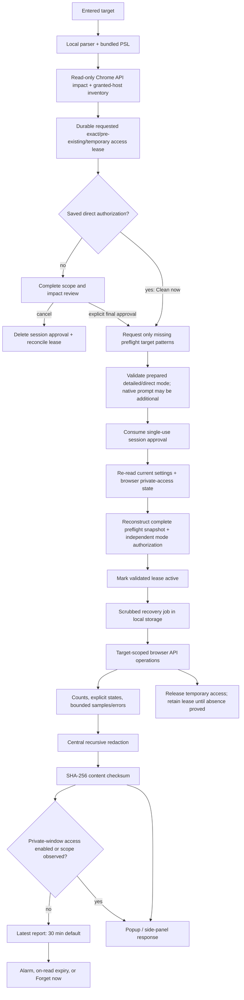

# Privacy data flow

> **Public-source prerelease candidate undergoing safety, privacy, accessibility, and binary-release validation.**

This document supplements [`PRIVACY.md`](../PRIVACY.md) with implementation-level flows. The separately recorded public policy URL must contain the exact approved policy for the candidate or release it describes.

## Runtime flow

No project-controlled server exists in this path. The developer-only PSL update script is outside the runtime and contacts only reviewed upstream sources when explicitly run.

## Data inventory

| Data                      | Source                                                              | Purpose                                                                                                                                                                                                                                                          | Storage/default                                                                                                                                                            | Sharing                            |
| ------------------------- | ------------------------------------------------------------------- | ---------------------------------------------------------------------------------------------------------------------------------------------------------------------------------------------------------------------------------------------------------------- | -------------------------------------------------------------------------------------------------------------------------------------------------------------------------- | ---------------------------------- |
| Entered/normalized target | User / active tab                                                   | Determine approved scope and display the normalized target                                                                                                                                                                                                       | Raw input is not retained in the final report; approval is short-lived in session storage                                                                                  | None automatically                 |
| Impact candidates         | Tabs, cookies, history, downloads, origins                          | Bind the reconstructed target/current settings/private context/impact/file IDs in both cleanup modes; show them in default detailed review or keep the same preflight hidden under explicitly saved direct authorization                                         | Approval record in session storage for up to five minutes                                                                                                                  | None automatically                 |
| Host-permission inventory | Privacy-minimized relevant subset of `permissions.getAll()` origins | Disclose/bind exact required grants, relevant broader pre-existing grants, required patterns covered broadly, and truthful all-site status; unrelated exact/wildcard hostnames are omitted and broader grants never authorize wider cleanup or automatic removal | Session approval and report evidence under their retention/redaction rules                                                                                                 | None automatically                 |
| Permission lease          | Normal-window preflight-requested exact host patterns               | Preserve pre-existing grants and recover only exact access that may be temporary; a `prompt_pending` record exists before the final/direct button can prompt; broader grants never enter removal; private-source missing patterns are refused                    | Minimal local record until every temporary pattern is proved absent; conservative prompt-pending recovery window is 30 minutes unless explicitly settled sooner            | None automatically                 |
| Active job                | Runtime progress                                                    | Cancellation/interruption visibility                                                                                                                                                                                                                             | Scrubbed local record until cleared/replaced                                                                                                                               | None automatically                 |
| Active shield             | DNR rules and target                                                | Clear/recover extension-owned rules                                                                                                                                                                                                                              | Scrubbed local record until proven cleared or approved expiry                                                                                                              | None automatically                 |
| Report                    | Runtime operations and verification                                 | Local evidence and troubleshooting; truthfully distinguishes detailed review from saved direct authorization                                                                                                                                                     | Preflight-bound privacy settings control redaction/history; default is redacted latest for 30 minutes with history off, and no persistence while private access is enabled | Only through explicit local export |
| Report history            | Prior reports                                                       | Optional comparison                                                                                                                                                                                                                                              | Opt-in, at most 10 and configured retention                                                                                                                                | Only through explicit local export |
| Debug summaries           | Runtime                                                             | Opt-in troubleshooting                                                                                                                                                                                                                                           | Off by default, bounded to 100, centrally scrubbed                                                                                                                         | Only if user copies/exports it     |
| Settings                  | User                                                                | Configure behavior                                                                                                                                                                                                                                               | Local until reset/uninstall                                                                                                                                                | Explicit local backup only         |
| Maintenance snapshot      | Extension                                                           | Explain expiry/recovery work                                                                                                                                                                                                                                     | Scrubbed local latest snapshot                                                                                                                                             | None automatically                 |

## Redaction flow

The central redactor is used for persisted reports, redacted JSON/text/HTML exports, bulk history, troubleshooting summaries, privacy migration, and debug/support values. It:

1. clones serializable input;
2. replaces schema-sensitive targets, URLs, origins, hosts, domains, referrers, paths, filenames, and related arrays;
3. scans every string for URL/domain/IP/email/extension-ID/path/secret-parameter/probable-filename patterns;
4. removes any prior checksum and computes SHA-256 over the transformed content;
5. serializes the result and rejects known sensitive patterns or supplied test canaries.

The candidate intentionally does not emit stable target hashes. Domains have low entropy, so an unsalted stable digest is susceptible to dictionary recovery. Redaction reduces accidental disclosure but cannot guarantee anonymity.

## Full-detail opt-in

Turning report redaction off is a settings opt-in that allows full detail in local report storage and the immediate result. The settings snapshot bound by the preflight controls persistence for that run, whether detailed review is shown or direct mode is used; a later settings write cannot silently turn a redacted/no-history run into an unredacted/history-retained record. Full JSON export requires a separate warning. The interface recommends redacted exports; users remain responsible for reviewing the destination and content.

## Private-window flow

The browser controls private access. A private-origin request without both **Allow in incognito** and exact preflight target access is rejected before preflight; SiteWipe does not request or durably store a missing private target pattern for a later prompt. The browser private-access state must equal the preflight-bound state at token consumption and the consumed value is then used throughout discovery, injection, tab changes/closure, overlays, and verification. A normal-only authorization therefore cannot expand into private tabs if the global browser setting changes. Whenever the browser reports private access enabled, a scrubbed recovery job/shield may exist locally because MV3 interruption must remain recoverable, but the completed report is not persisted—even when the source window is normal—because the extension cannot prove private scope was unaffected. The immediate result follows the preflight-bound redaction setting and truthfully identifies detailed or direct authorization. The privacy policy must not imply that incognito prevents browser, OS, employer, network, or website retention.

## Deletion and retention controls

- **Forget report now** clears the latest report immediately.
- **Delete stored report history** clears only prior-history entries and preserves the separately retained latest report; **Forget report now** removes that latest item and its duplicate history entry, if present.
- Scheduled maintenance and every report read enforce latest-report expiry.
- Reset clears settings, reports, logs, maintenance state, and finished job state; shield and temporary-access recovery records are retained whenever Chrome cannot prove the owned DNR/permission state empty.
- Settings export contains only an allowlisted SiteWipe settings object and metadata. Import rejects oversized, foreign/newer-schema, malformed, empty, or invalid-value files; ignores unknown keys; and requires one preview/confirmation of recognized changes and privacy/destructive risks before saving. It does not import reports, logs, jobs, shields, or website data.
- Uninstall asks the browser to remove extension-local storage, subject to browser behavior.

## Data-protection limits

The extension cannot control Chrome's own diagnostic logging, Sync, backups, disk remnants, other extensions, enterprise tooling, the operating system, networks, or websites. A content checksum detects content changes only; it is not encryption, authentication, a deletion proof, or an integrity guarantee against a malicious local actor.
